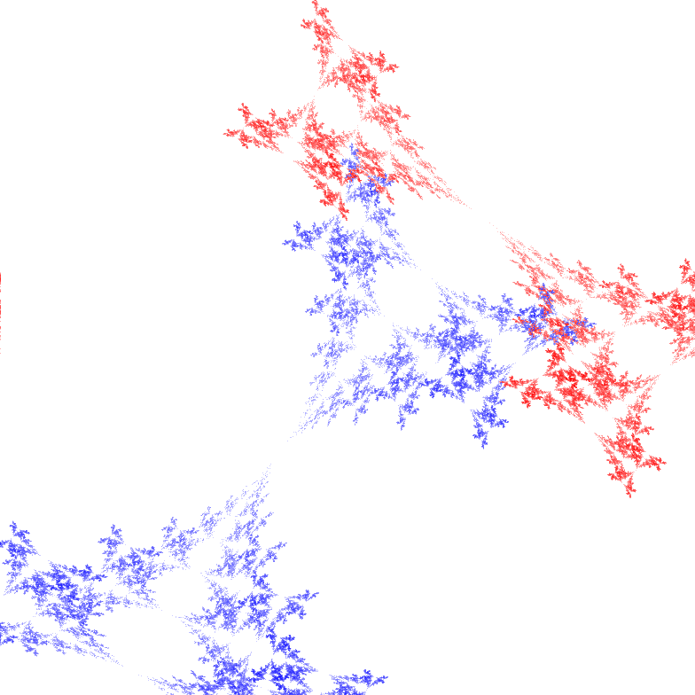

# IFS Editor

Inspired by [this page](http://paulbourke.net/fractals/ifs/).

Try it [here](https://blog.fredrikmeyer.net/ifs-editor/).



## Usage

Run locally (a browser opens on `http://localhost:5173/ifs-editor/`):

```
yarn start
```

Run tests:

```
yarn test
```

Get test coverage by adding `--coverage`.

## Resources

### Colors

 - [Useful color conversion formulas](https://color.lukas-stratmann.com/color-systems/hsl.html)

### Fractals

 - [Intro to fractals](https://users.math.yale.edu/public_html/People/frame/Fractals/Labs/IFSLab/IFSLab.html)
 - [Image Based Rendering of Iterated Function Systems](https://www.uni-konstanz.de/mmsp/pubsys/publishedFiles/WiSa04.pdf) Another algorithm to generate IFS's. The references also refers to more efficient methods to generate IFS. See [here](https://www.win.tue.nl/~vanwijk/ibifs/) for more.

## Ideas / links

### Fractal Flame Algorithm

[Fractal Flame Algorithm](https://flam3.com/flame_draves.pdf)

Would want to implement the ideas in this paper. 

### Larry Riddle's home page

[Link](https://larryriddle.agnesscott.org/ifs/ifs.htm)

Nice pictures and explanations.

### IFS Construction Kit

Larry Riddle's [program](https://larryriddle.agnesscott.org/ifskit/gallery/gallery.htm).

Would be interesting to parse his IFS file format.

### Use WASM + Rust for drawing to Canvas?

See this [Julia set example](https://rustwasm.github.io/wasm-bindgen/examples/julia.html).

Or perhaps AssemblyScript? Example [here](https://www.assemblyscript.org/examples/interference.html).

### Java implementation

[jonas-lj/IFS-Fractals](https://github.com/jonas-lj/IFS-Fractals)

### Fracal Exercises

 - [Identify the IFS from the fractal](https://users.math.yale.edu/public_html/People/frame/Fractals/Labs/IFSLab/IFSLab.html)

### TODOS

 - Add animation on parameters (i.e. let a parameter animate from 0 to max value)
 - Save nice fractals
 - Support for other fractals than IFS
 - Tighter UI (components are a bit big now, less clicking)

## Similar Projects

 - [Fractal-Inferno](https://github.com/tariqksoliman/Fractal-Inferno) Implements the Flame algorithm in JS.
 - [py-fractal](https://github.com/pysrc/fractal) Fractals drawn in Python.
 - [glChAoS.P](https://github.com/BrutPitt/glChAoS.P "C++ project/app or generating many types of fractals")
